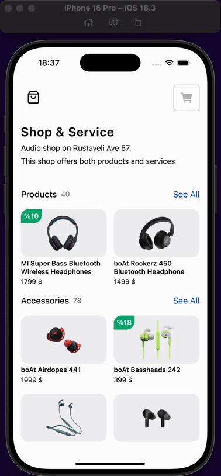
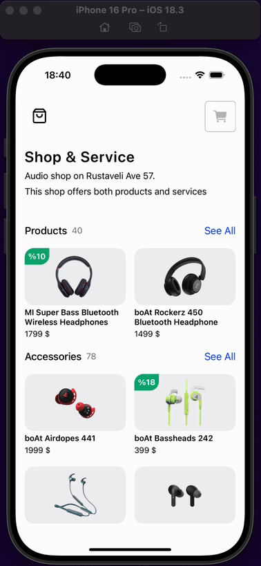

<h1>E-commerce App</h1>

This project is an e-commerce application developed with React Native. Application consists of home page, product detail page and my cart page. User can view products on home page. They can also view the details of the product on the product detail page and add it to the cart. Users can increase or decrease the number of products from the cart page and remove them from the cart. They can check the order information and complete the order.

<ul>

<li>@react-native-async-storage/async-storage</li>
<li>@react-navigation/native</li>
<li>@react-navigation/native-stack</li>
<li>react-native-gesture-handler</li>
<li>react-native-safe-area-context</li>
<li>react-native-screens</li>
<li>react-native-toast-message</li>
<li>react-native-uuid</li>
<li>react-native-vector-icons</li>
<li>toastify-react-native</li>

</ul>

<h1>Screen Gifs</h1>

